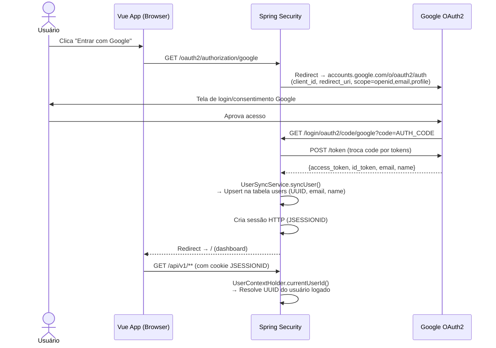
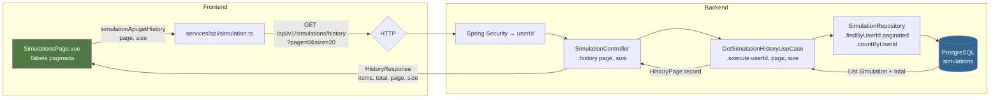
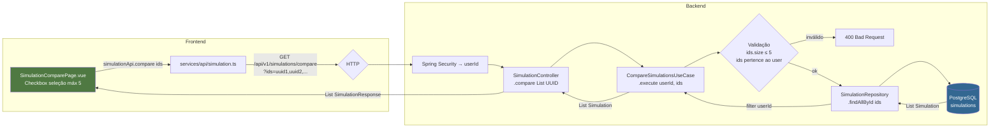
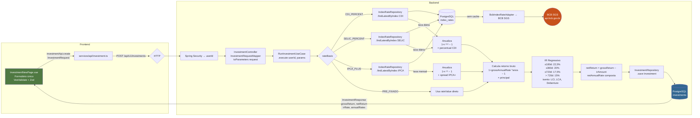
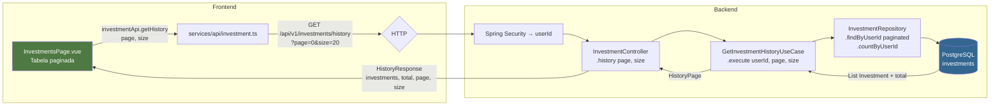
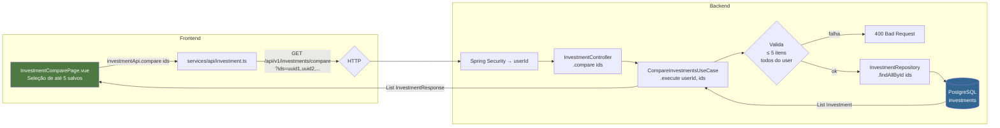
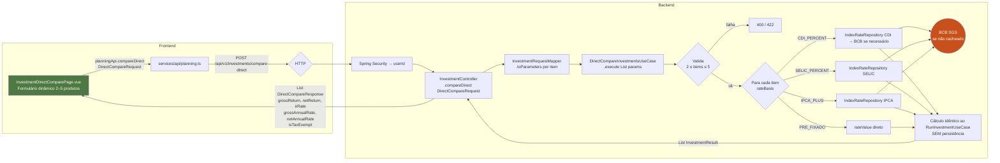
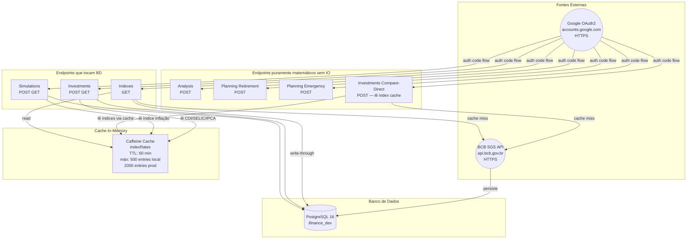

# iFinance — Diagramas de Fluxo de Dados

> Cada diagrama cobre o fluxo completo: componente Vue → service TypeScript → HTTP → Spring Security → Controller → Use Case → Repository → BD / API externa.

---

## Legenda

```
[ Vue Component ]  →  { Service TS }  →  |HTTP|  →  (Spring)  →  [UseCase]  →  <Repository>  →  ((DB / API))
```

---

## 0. Autenticação OAuth2 Google



---

## 1. Simulações

### 1.1 — Criar Simulação `POST /api/v1/simulations`

```mermaid
flowchart LR
    subgraph Frontend
        A[SimulationNewPage.vue\nFormulário em 3 etapas\nVeeValidate + Zod] -->|simulationApi.create\nSimulationRequest JSON| B[services/api/simulation.ts]
        B -->|POST /api/v1/simulations\nBearer: JSESSIONID| C{HTTP Client\nAxios}
    end

    subgraph Backend
        C --> D[Spring Security\nVerifica sessão\nExtrai userId]
        D --> E[SimulationController\nPOST /api/v1/simulations\n@Valid SimulationRequest]
        E --> F[RunSimulationUseCase\n.execute userId, params]

        F --> G{rateBasis\ninflação?}
        G -->|sim| H[IndexRateRepository\n.findLatestByIndex IPCA/IGPM]
        H --> I[(PostgreSQL\nindex_rates)]
        I -->|IndexRate mensal| H
        H -->|sem dados locais| J[BcbIndexRateAdapter\n→ BcbClient.fetchSeries]
        J -->|HTTPS GET SGS| K((BCB SGS API\napi.bcb.gov.br))
        K -->|JSON taxa mensal| J
        J --> I

        G -->|não| L[RateConverter\nNominal ↔ Efetiva\nMensal ↔ Anual]
        H --> L

        L --> M[InflationCorrectionEngine\nCorrige saldo pelo índice]
        M --> N[AmortizationEngine\nGera tabela de parcelas\nSAC / PRICE / AMERICANO\nALEMÃO / SAM]
        N --> O[IrrCalculator\nCalcula CET / TIR]
        O --> P[SimulationRepository\n.save Simulation]
        P --> Q[(PostgreSQL\nsimulations\ninstallments)]
    end

    Q -->|SimulationResponse JSON| A
    style A fill:#4f7942,color:#fff
    style K fill:#c8511b,color:#fff
    style Q fill:#336791,color:#fff
```



---

### 1.2 — Buscar Simulação por ID `GET /api/v1/simulations/{id}`

```mermaid
flowchart LR
    subgraph Frontend
        A[SimulationDetailPage.vue\nuseQuery TanStack] -->|simulationApi.getById id| B[services/api/simulation.ts]
        B -->|GET /api/v1/simulations/{id}| C{HTTP}
    end

    subgraph Backend
        C --> D[Spring Security]
        D --> E[SimulationController\n.getById PathVariable id]
        E --> F[SimulationRepository\n.findById id]
        F --> G[(PostgreSQL\nsimulations)]
        G -->|Optional Simulation| F
        F -->|filter userId == currentUser| E
        E -->|404 se não encontrado\nou de outro usuário| R[ResponseEntity 404]
        E -->|SimulationResponse| A
    end

    style A fill:#4f7942,color:#fff
    style G fill:#336791,color:#fff
```

---

### 1.3 — Histórico de Simulações `GET /api/v1/simulations/history`



---

### 1.4 — Comparar Simulações `GET /api/v1/simulations/compare`



---

### 1.5 — Amortização Antecipada `GET /api/v1/simulations/{id}/prepayment`

```mermaid
flowchart LR
    subgraph Frontend
        A[SimulationDetailPage.vue\nInput período de amortização] -->|simulationApi.getPrepayment\nid, period| B[services/api/simulation.ts]
        B -->|GET /api/v1/simulations/{id}/prepayment\n?period=12| C{HTTP}
    end

    subgraph Backend
        C --> D[Spring Security → userId]
        D --> E[SimulationController\n.prepayment id, period]
        E --> F[PrepaymentUseCase\n.execute userId, simId, period]
        F --> G[SimulationRepository\n.findById]
        G --> H[(PostgreSQL\nsimulations + installments)]
        H -->|Simulation com schedule| F
        F --> I[Calcula VP das parcelas\nrestantes descontadas\nà taxa contratada]
        I -->|PrepaymentResult\ndiscount, savingsPercent\nremainingBalance| E
        E -->|PrepaymentResponse| A
    end

    style A fill:#4f7942,color:#fff
    style H fill:#336791,color:#fff
```

---

### 1.6 — Listar Snapshots `GET /api/v1/simulations/{id}/snapshots`

```mermaid
flowchart LR
    subgraph Frontend
        A[SimulationDetailPage.vue\nAba Snapshots] -->|simulationApi.getSnapshots id| B[services/api/simulation.ts]
        B -->|GET /api/v1/simulations/{id}/snapshots| C{HTTP}
    end

    subgraph Backend
        C --> D[Spring Security → userId]
        D --> E[SimulationController\n.snapshots id]
        E --> F[GetSnapshotsUseCase\n.execute userId, simId]
        F --> G[SimulationRepository\n.findById — verifica ownership]
        G --> H[(PostgreSQL\nsimulations)]
        F --> I[SnapshotRepository\n.findBySimulationId]
        I --> J[(PostgreSQL\nsimulation_snapshots)]
        J -->|List SimulationSnapshot| F
        F -->|List SnapshotResponse| A
    end

    style A fill:#4f7942,color:#fff
    style H fill:#336791,color:#fff
    style J fill:#336791,color:#fff
```

---

### 1.7 — Salvar Snapshot `POST /api/v1/simulations/{id}/snapshots`

```mermaid
flowchart LR
    subgraph Frontend
        A[SimulationDetailPage.vue\nBotão Salvar Snapshot] -->|simulationApi.createSnapshot id| B[services/api/simulation.ts]
        B -->|POST /api/v1/simulations/{id}/snapshots| C{HTTP}
    end

    subgraph Backend
        C --> D[Spring Security → userId]
        D --> E[SimulationController\n.createSnapshot id]
        E --> F[CreateSnapshotUseCase\n.execute userId, simId]
        F --> G[SimulationRepository\n.findById — verifica ownership]
        G --> H[(PostgreSQL\nsimulations)]
        F --> I[SnapshotRepository\n.save\nnew SimulationSnapshot UUID]
        I --> J[(PostgreSQL\nsimulation_snapshots)]
        J -->|SnapshotEntity saved| F
        F -->|SnapshotResponse\nid, params, createdAt| A
    end

    style A fill:#4f7942,color:#fff
    style H fill:#336791,color:#fff
    style J fill:#336791,color:#fff
```

---

## 2. Investimentos

### 2.1 — Calcular Investimento `POST /api/v1/investments`



---

### 2.2 — Buscar Investimento por ID `GET /api/v1/investments/{id}`

```mermaid
flowchart LR
    subgraph Frontend
        A[InvestmentDetailPage.vue] -->|investmentApi.getById id| B[services/api/investment.ts]
        B -->|GET /api/v1/investments/{id}| C{HTTP}
    end

    subgraph Backend
        C --> D[Spring Security → userId]
        D --> E[InvestmentController\n.getById id]
        E --> F[InvestmentRepository\n.findById id]
        F --> G[(PostgreSQL\ninvestments)]
        G -->|Optional Investment| E
        E -->|filter userId == currentUser| H{encontrado?}
        H -->|não| R[404 InvestmentNotFoundException]
        H -->|sim| A
    end

    style A fill:#4f7942,color:#fff
    style G fill:#336791,color:#fff
```

---

### 2.3 — Histórico de Investimentos `GET /api/v1/investments/history`



---

### 2.4 — Comparar Investimentos Salvos `GET /api/v1/investments/compare`



---

### 2.5 — Comparação Direta sem Salvar `POST /api/v1/investments/compare-direct`



---

## 3. Índices Econômicos

### 3.1 — Taxa Atual `GET /api/v1/indexes/{index}/current`

```mermaid
flowchart LR
    subgraph Frontend
        A[IndexRatesWidget.vue\nDashboardPage.vue\nstaleTime: 10 min] -->|indexesApi.getAllCurrent\nLote 1: CDI, IPCA, SELIC\nLote 2: TR, IGP_M| B[services/api/indexes.ts]
        B -->|GET /api/v1/indexes/CDI/current\nGET /api/v1/indexes/IPCA/current\n...5 requests paralelos| C{HTTP}
    end

    subgraph Backend
        C --> D[Spring Security]
        D --> E[IndexController\n.current index]
        E --> F[FetchIndexRateUseCase\n.fetchCurrent index]

        F --> G[BcbIndexRateAdapter\n@Primary @Cacheable\ncache: indexRates]
        G --> H{Cache\nCaffeine\ntem entrada?}
        H -->|sim| I[IndexRateResponse.from\nannualize taxa bruta]
        H -->|não| J[IndexRateJpaRepository\n.findLatestByIndexCode]
        J --> K[(PostgreSQL\nindex_rates)]
        K -->|IndexRateEntity| J
        J -->|sem dados no BD| L[BcbClient.fetchSeries\núltimos 13 meses]
        L -->|HTTPS GET SGS| M((BCB SGS API\napi.bcb.gov.br\nsérie 12/11/433/189/226))
        M -->|JSON taxa bruta| L
        L --> N[Persiste em index_rates\nsource=BCB_SGS\nfetched_at=now]
        N --> K

        J & N --> I
        I --> O[Converte taxa bruta → % anual\nDIARY: 1+r ²⁵² − 1\nMONTHLY: 1+r ¹² − 1\nsetScale 2]
    end

    O -->|IndexRateResponse\nindex, referenceDate\nannualRate %, isProjection| A
    style A fill:#4f7942,color:#fff
    style M fill:#c8511b,color:#fff
    style K fill:#336791,color:#fff
```

---

### 3.2 — Série Histórica `GET /api/v1/indexes/{index}`

```mermaid
flowchart LR
    subgraph Frontend
        A[ChartComponent.vue\nGráfico histórico] -->|indexesApi.getRange\nindex, from, to| B[services/api/indexes.ts]
        B -->|GET /api/v1/indexes/IPCA\n?from=2024-01-01&to=2025-01-01| C{HTTP}
    end

    subgraph Backend
        C --> D[Spring Security]
        D --> E[IndexController\n.range index, from, to]
        E --> F[FetchIndexRateUseCase\n.fetchRange index, from, to]

        F --> G{to > hoje?}
        G -->|não — histórico puro| H[IndexRateRepository\n.findByIndexAndDateRange]
        H --> I[(PostgreSQL\nindex_rates)]
        I -->|dados ausentes| J[BcbClient → BCB SGS]
        J --> K((BCB SGS API))

        G -->|sim — inclui futuro| L[Busca histórico até hoje\n+ projeta meses futuros\nusando última taxa conhecida\nisProjection = true]
        L --> H

        H & L --> M[Para cada IndexRate:\nIndexRateResponse.from → annualize]
    end

    M -->|List IndexRateResponse\nannualRate por período| A
    style A fill:#4f7942,color:#fff
    style K fill:#c8511b,color:#fff
    style I fill:#336791,color:#fff
```



---

## 4. Análise de Viabilidade

### 4.1 — Calcular NPV / TIR / Payback `POST /api/v1/analysis`

```mermaid
flowchart LR
    subgraph Frontend
        A[AnalysisPage.vue\nTabela de fluxos de caixa\n+ taxa de desconto] -->|analysisApi.analyze\nAnalysisRequest| B[services/api/analysis.ts]
        B -->|POST /api/v1/analysis\ncashFlows, discountRate| C{HTTP}
    end

    subgraph Backend
        C --> D[Spring Security → userId]
        D --> E[AnalysisController\n@Valid AnalysisRequest\ncashFlows: List BigDecimal\ndiscountRate: BigDecimal]
        E --> F[FinancialAnalysisUseCase\n.execute cashFlows, discountRate]

        F --> G[NpvCalculator\nΣ CFₜ ÷ 1+r ^t]
        F --> H[IrrCalculator\nNewton-Raphson\nf r = Σ CFₜ ÷ 1+r ^t = 0]
        F --> I[PaybackCalculator\nSimples: período em que\nΣ CF ≥ 0\nDescontado: usando VP dos fluxos]

        G -->|npv, npvPositive| J[AnalysisResult]
        H -->|irrPercent, irrDecimal| J
        I -->|simplePayback, discountedPayback| J
    end

    J -->|AnalysisResponse\nnpv, irrPercent\nsimplePaybackPeriod\ndiscountedPaybackPeriod| A

    note1[Sem acesso a BD\nCálculo puramente matemático\nem memória]
    F -.-> note1

    style A fill:#4f7942,color:#fff
    style note1 fill:#666,color:#fff
```

---

## 5. Planejamento Financeiro

### 5.1 — Planejamento FIRE `POST /api/v1/planning/retirement`

```mermaid
flowchart LR
    subgraph Frontend
        A[RetirementPage.vue\nDespesas, poupança, retorno\nregra dos 4%] -->|planningApi.retirement\nRetirementRequest| B[services/api/planning.ts]
        B -->|POST /api/v1/planning/retirement| C{HTTP}
    end

    subgraph Backend
        C --> D[Spring Security → userId]
        D --> E[PlanningController\n@Valid RetirementRequest\nmonthlyExpenses, currentSavings\nmonthlySavings, expectedAnnualReturn\nwithdrawalRate]
        E --> F[RetirementPlanningUseCase\n.execute params]

        F --> G[Meta FIRE\ntarget = despesasAnuais ÷ withdrawalRate\nex: 12×5.000 ÷ 0,04 = R$ 1.500.000]
        G --> H{currentSavings\n≥ target?}
        H -->|sim| I[alreadyFire = true\nmesesFire = 0]
        H -->|não| J[n = log target×r + S ÷ C×r + S\n    ÷ log 1 + r\nr = retorno mensal\nS = poupança mensal\nC = saldo atual]
        J --> K[Projeta 10 anos\nC × 1+r ¹²⁰ + S × 1+r ¹²⁰ − 1 ÷ r]
        K --> L[Projeta 20 anos\nmesmo fórmula com 240]

        I & L --> M[RetirementResult]
    end

    M -->|RetirementResponse\ntargetAmount, monthsToFire\nyearsToFire, alreadyFire\nproj10Year, proj20Year| A

    note1[Sem acesso a BD\nCálculo puramente matemático]
    F -.-> note1

    style A fill:#4f7942,color:#fff
    style note1 fill:#666,color:#fff
```

---

### 5.2 — Reserva de Emergência `POST /api/v1/planning/emergency`

```mermaid
flowchart LR
    subgraph Frontend
        A[EmergencyPage.vue\nDespesas, meses de cobertura\npoupança atual e mensal] -->|planningApi.emergency\nEmergencyRequest| B[services/api/planning.ts]
        B -->|POST /api/v1/planning/emergency| C{HTTP}
    end

    subgraph Backend
        C --> D[Spring Security → userId]
        D --> E[PlanningController\n@Valid EmergencyRequest\nmonthlyExpenses, monthsCoverage\ncurrentSavings, monthlySavings\nexpectedAnnualReturn optional]
        E --> F[EmergencyReserveUseCase\n.execute params]

        F --> G[Meta\ntarget = despesas × meses\nex: 5.000 × 6 = R$ 30.000]
        G --> H[Progresso\nprogress = currentSavings ÷ target × 100]
        H --> I{currentSavings\n≥ target?}
        I -->|sim| J[targetReached = true\nmonthsToComplete = 0]
        I -->|não| K[deficit = target − currentSavings\nmesesFaltantes = deficit ÷ monthlySavings\nse expectedReturn informado:\ncalcula com juros compostos]
        K --> L[monthlyShortfall = deficit ÷ mesesFaltantes]
        J & L --> M[EmergencyReserveResult]
    end

    M -->|EmergencyResponse\ntargetAmount, progressPercent\ncurrentCoverageMonths\ntargetReached, monthsToComplete\nmonthlyShortfall| A

    note1[Sem acesso a BD\nCálculo puramente matemático]
    F -.-> note1

    style A fill:#4f7942,color:#fff
    style note1 fill:#666,color:#fff
```

---

## Visão Consolidada — Dependências de Infraestrutura



---

## Tabela Resumo

| Endpoint | Método | Acessa BD? | Acessa BCB? | Persiste? | Auth |
|---|---|---|---|---|---|
| `POST /simulations` | POST | ✅ lê índices, ✅ grava | 🔄 se cache miss | ✅ simulations | OAuth2 |
| `GET /simulations/{id}` | GET | ✅ lê | ❌ | ❌ | OAuth2 |
| `GET /simulations/history` | GET | ✅ lê | ❌ | ❌ | OAuth2 |
| `GET /simulations/compare` | GET | ✅ lê | ❌ | ❌ | OAuth2 |
| `GET /simulations/{id}/prepayment` | GET | ✅ lê | ❌ | ❌ | OAuth2 |
| `GET /simulations/{id}/snapshots` | GET | ✅ lê | ❌ | ❌ | OAuth2 |
| `POST /simulations/{id}/snapshots` | POST | ✅ lê + grava | ❌ | ✅ snapshots | OAuth2 |
| `POST /investments` | POST | ✅ lê índices, ✅ grava | 🔄 se cache miss | ✅ investments | OAuth2 |
| `GET /investments/{id}` | GET | ✅ lê | ❌ | ❌ | OAuth2 |
| `GET /investments/history` | GET | ✅ lê | ❌ | ❌ | OAuth2 |
| `GET /investments/compare` | GET | ✅ lê | ❌ | ❌ | OAuth2 |
| `POST /investments/compare-direct` | POST | 🔄 lê índices (cache) | 🔄 se cache miss | ❌ | OAuth2 |
| `GET /indexes/{index}/current` | GET | 🔄 lê/grava (cache) | 🔄 se cache miss | 🔄 se buscou BCB | OAuth2 |
| `GET /indexes/{index}` | GET | 🔄 lê/grava | 🔄 se cache miss | 🔄 se buscou BCB | OAuth2 |
| `POST /analysis` | POST | ❌ | ❌ | ❌ | OAuth2 |
| `POST /planning/retirement` | POST | ❌ | ❌ | ❌ | OAuth2 |
| `POST /planning/emergency` | POST | ❌ | ❌ | ❌ | OAuth2 |
